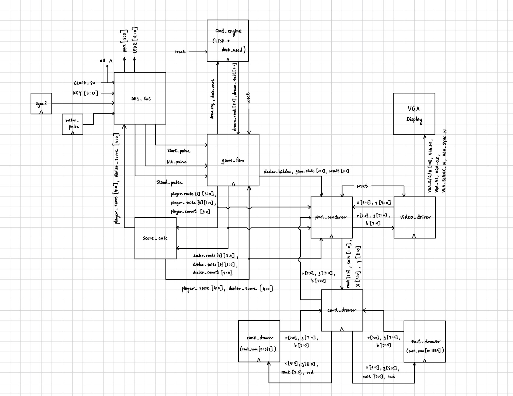

# FPGA Blackjack with VGA Display

A single-player Blackjack game implemented in SystemVerilog for the Terasic DE1-SoC FPGA development board. The design includes FSM-controlled gameplay, pseudo-random card generation without replacement, Blackjack score calculation, ROM-based card graphics, hardware button controls, seven-segment score output, and a 640×480 VGA interface.



## Project Overview

This project implements a complete round of Blackjack directly in FPGA hardware.

The player begins a round, receives two cards, and may choose to hit or stand. The dealer receives two cards with one card initially hidden, then automatically draws until reaching a score of at least 17. The system evaluates both hands and displays whether the player won, lost, or tied with the dealer.

The full design runs on the DE1-SoC without a software processor. Game state, hand storage, score calculation, card generation, input handling, and VGA rendering are implemented using SystemVerilog hardware modules.

## Features

- Single-player Blackjack gameplay
- Initial two-card deal for the player and dealer
- Hidden dealer hole card during the player turn
- Player hit and stand controls
- Automatic dealer behavior
- Dealer draws until reaching at least 17
- Player bust and dealer bust detection
- Player win, dealer win, and push outcomes
- Blackjack score calculation with flexible Ace values
- Pseudo-random card generation using a 16-bit LFSR
- 52-bit used-card tracking to prevent duplicate cards within a round
- Six card slots for the player and six for the dealer
- ROM-based card rank and suit graphics
- 640×480 VGA output
- Seven-segment player and dealer score displays
- Synchronized and edge-detected push-button inputs
- Separate ModelSim testbenches for the major game modules

## Hardware and Development Tools

### Hardware

- **Development board:** Terasic DE1-SoC
- **FPGA family:** Intel Cyclone V
- **FPGA device:** `5CSEMA5F31C6`
- **Display:** 640×480 VGA monitor
- **Inputs:** Onboard active-low push buttons
- **Additional outputs:** Onboard seven-segment displays

### Tools

- SystemVerilog
- Verilog
- Intel Quartus Prime Lite
- ModelSim Intel FPGA Starter Edition
- LabsLand remote FPGA environment

The submitted project was compiled using Quartus Prime Lite 17.0.

## Controls

| Input | Action |
|---|---|
| `KEY[0]` | System reset |
| `KEY[1]` | Start a new round |
| `KEY[2]` | Hit |
| `KEY[3]` | Stand |

The DE1-SoC push buttons are active-low. Each input passes through a two-stage synchronizer and an edge detector before entering the game controller.

## Score Displays

| Display | Function |
|---|---|
| `HEX1–HEX0` | Player score |
| `HEX5–HEX4` | Dealer score |

The dealer score remains hidden while the dealer's second card is face-down. It becomes visible when the dealer turn begins.

## Gameplay Flow

A Blackjack round follows this sequence:

1. The system waits in the idle state.
2. The player presses Start.
3. The used-card tracker is cleared for the new round.
4. Two cards are dealt to the player.
5. Two cards are dealt to the dealer.
6. The dealer's second card remains hidden.
7. The player chooses Hit or Stand.
8. A hit adds another card to the player's hand.
9. A player score above 21 immediately ends the round as a loss.
10. Standing reveals the dealer's hidden card.
11. The dealer automatically draws while its score is below 17.
12. The final scores are compared.
13. The VGA display shows a win, loss, or push result.
14. The system waits for the player to start another round.

## Finite-State Machine

The `game_fsm` module controls the complete round through seven states:

```text
IDLE
DEAL
PLAYER_TURN
PLAYER_HIT
DEALER_TURN
EVALUATE
RESULT_ST
